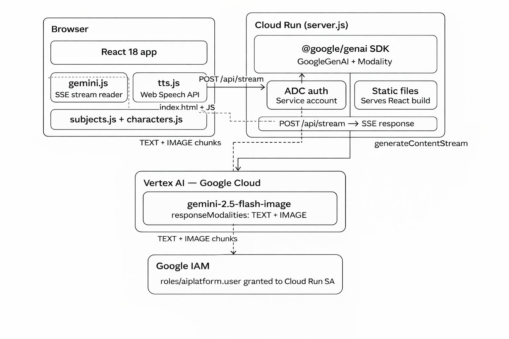

# Toon World

An educational app for children aged 4–8. Original cartoon characters teach subjects like counting, the alphabet, and animals through AI-generated interleaved text and image lessons — powered by Google Gemini on Google Cloud.

---


## Running locally

### Prerequisites

- [Node.js 20+](https://nodejs.org)
- [Google Cloud CLI](https://cloud.google.com/sdk/docs/install)
- A GCP project with **Vertex AI API** enabled

### Steps

```bash
# 1. Authenticate with Google Cloud
gcloud auth application-default login
gcloud config set project YOUR_PROJECT_ID

# 2. Install server dependencies (includes @google/genai SDK)
npm install

# 3. Build the React frontend
cd client && npm install && npm run build && cd ..

# 4. Start the server
GOOGLE_CLOUD_PROJECT=your-project-id node server.js

# 5. Open the app
#    http://localhost:8080
```

The Vite dev server (hot reload) is also available if you need it:

```bash
# Terminal 1
GOOGLE_CLOUD_PROJECT=your-project-id node server.js

# Terminal 2
cd client && npm run dev
# Open http://localhost:5173
```

---

## Architecture


---

## How it works

1. The child picks a **subject** (e.g. "Basic Addition") and a **cartoon teacher** (e.g. "Professor Twigs")
2. The app calls Gemini via the `@google/genai` SDK using `generateContentStream` with `responseModalities: [TEXT, IMAGE]`
3. Gemini streams back an interleaved lesson — alternating text paragraphs and matching illustrations generated from the same context window
4. Each block appears on screen the moment it arrives, creating a live storybook effect
5. A 🔊 speaker button on every paragraph reads it aloud using the browser's Web Speech API

---

## Tech stack

| Layer | Technology |
|---|---|
| **Frontend** | React 18, Vite, React Router |
| **Backend** | Node.js, `@google/genai` SDK |
| **AI model** | `gemini-2.5-flash-image` via Vertex AI |
| **GCP services** | Vertex AI, Cloud Run, Cloud Build, IAM |
| **Auth** | Application Default Credentials (ADC) — no API keys in code |
| **TTS** | Browser Web Speech API |
| **Deployment** | Docker + Cloud Run (`deploy.sh`) |

---

## Project structure

```
toon-world/
├── server.js                   ← Node.js backend (all Gemini calls live here)
├── package.json                ← Server deps — includes @google/genai
├── Dockerfile                  ← Two-stage build for Cloud Run
├── deploy.sh                   ← One-command Cloud Run deployment
│
└── client/                     ← React frontend (Vite)
    ├── src/
    │   ├── api/
    │   │   ├── gemini.js       ← Prompt builder + SSE stream reader
    │   │   └── tts.js          ← Browser Web Speech API wrapper
    │   ├── data/
    │   │   ├── subjects.js     ← 21 lesson topics
    │   │   └── characters.js   ← 16 original cartoon characters
    │   ├── components/
    │   │   ├── TileCard.jsx    ← Individual subject/character tile
    │   │   ├── TilePicker.jsx  ← Horizontal scrollable picker row
    │   │   ├── LessonBlock.jsx ← Renders one text or image block
    │   │   ├── SpeakerButton.jsx ← TTS play/stop button
    │   │   └── Background.jsx  ← Animated starfield + orbs
    │   ├── pages/
    │   │   ├── HomePage.jsx    ← "I want to learn ___ with ___!" sentence builder
    │   │   └── LessonPage.jsx  ← Streams and renders the interleaved lesson
    │   ├── hooks/
    │   │   └── useSpeech.js    ← TTS state management hook
    │   ├── utils/
    │   │   └── slug.js         ← URL slug helpers
    │   ├── styles/
    │   │   ├── global.css      ← Design tokens, reset, animated background
    │   │   └── components.css  ← All component styles
    │   ├── App.jsx             ← Router root
    │   └── main.jsx            ← React entry point
    ├── vite.config.js
    └── package.json
```

---

## Why Vertex AI instead of AI Studio

| | AI Studio | Vertex AI (this app) |
|---|---|---|
| Auth | API key passed in URL | Service account / ADC — no keys in code |
| SDK | `@google/genai` (both work) | `@google/genai` with `vertexai: true` |
| Suitable for | Prototyping | Production on Google Cloud |

On Cloud Run the server authenticates automatically via its service account — no secrets to manage.

---

## How interleaved streaming works

The core feature is a single SDK call that returns text and images together:

```js
// server.js
const stream = await ai.models.generateContentStream({
  model:    'gemini-2.5-flash-image',
  contents: [{ role: 'user', parts: [{ text: prompt }] }],
  config: {
    responseModalities: [Modality.TEXT, Modality.IMAGE],
  },
});

for await (const chunk of stream) {
  // Each chunk may contain a text paragraph or an image
  // Sent to the browser as SSE as soon as it arrives
  res.write(`data: ${JSON.stringify(chunk)}\n\n`);
}
```

The browser reads this SSE stream in `client/src/api/gemini.js` and calls `onBlock()` for each completed part. `LessonPage.jsx` appends each block to React state immediately, so the lesson renders block by block — not all at once.

---

## Deploying to Cloud Run

```bash
chmod +x deploy.sh
./deploy.sh
```

This script:
1. Builds the Docker image via **Cloud Build**
2. Pushes it to **Google Container Registry**
3. Deploys to **Cloud Run** in `us-central1`
4. Grants `roles/aiplatform.user` to the Cloud Run service account so it can call Vertex AI

After deployment, Cloud Run logs show each streaming call:

```
[SDK] Starting stream — model: gemini-2.5-flash-image, location: global
[SDK] Stream complete — 7 parts sent
```

---

## Customising

| What | Where |
|---|---|
| Add or change subjects | `client/src/data/subjects.js` |
| Add or change characters | `client/src/data/characters.js` |
| Change the lesson prompt | `server.js` → `buildLessonPrompt()` in `gemini.js` |
| Change the AI model | `server.js` → `const MODEL = '...'` |
| Switch TTS provider | `client/src/api/tts.js` |
